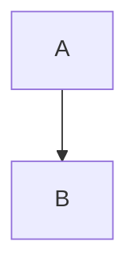

# Use Case Diagrams - Combiphar Used Goods

## Overview

Total: **16 Use Case** (6 Customer, 10 Admin)

## Directory Structure

```
docs/use-case/
├── overview.puml          # PlantUML overview diagram
├── overview.mmd           # Mermaid overview diagram
├── README.md              # This file
├── plantuml/              # PlantUML diagrams
│   ├── overview.puml
│   ├── customer/          # 6 files
│   │   ├── uc01-manage-account.puml
│   │   ├── uc02-browse-products.puml
│   │   ├── uc03-manage-cart.puml
│   │   ├── uc04-manage-addresses.puml
│   │   ├── uc05-checkout.puml
│   │   └── uc06-make-payment.puml
│   └── admin/             # 10 files
│       ├── uc07-login-admin.puml
│       ├── uc08-view-dashboard.puml
│       ├── uc09-manage-categories.puml
│       ├── uc10-manage-products.puml
│       ├── uc11-quality-control.puml
│       ├── uc12-manage-orders.puml
│       ├── uc13-verify-payments.puml
│       ├── uc14-manage-shipments.puml
│       ├── uc15-manage-users.puml
│       └── uc16-view-reports.puml
├── customer/              # Mermaid diagrams (6 files)
│   ├── uc01-manage-account.mmd
│   ├── uc02-browse-products.mmd
│   ├── uc03-manage-cart.mmd
│   ├── uc04-manage-addresses.mmd
│   ├── uc05-checkout.mmd
│   └── uc06-make-payment.mmd
└── admin/                 # Mermaid diagrams (10 files)
    ├── uc07-login-admin.mmd
    ├── uc08-view-dashboard.mmd
    ├── uc09-manage-categories.mmd
    ├── uc10-manage-products.mmd
    ├── uc11-quality-control.mmd
    ├── uc12-manage-orders.mmd
    ├── uc13-verify-payments.mmd
    ├── uc14-manage-shipments.mmd
    ├── uc15-manage-users.mmd
    └── uc16-view-reports.mmd
```

## Customer Use Cases (6)

| ID | Use Case | Description |
|----|----------|-------------|
| UC01 | Manage Account | Login, Register, Logout, View Profile |
| UC02 | Browse Products | Search, Filter, View Detail |
| UC03 | Manage Cart | Add, Update, Remove, Clear |
| UC04 | Manage Addresses | Add, Set Primary, Delete |
| UC05 | Checkout | Select Address, Select Courier |
| UC06 | Make Payment | Upload Bukti Transfer |

## Admin Use Cases (10)

| ID | Use Case | Description |
|----|----------|-------------|
| UC07 | Login Admin | Admin authentication |
| UC08 | View Dashboard | Stats, Revenue Trends |
| UC09 | Manage Categories | CRUD, Import/Export |
| UC10 | Manage Products | CRUD, Stock/Status, Import/Export |
| UC11 | Quality Control | Perform QC, Batch Approve/Reject |
| UC12 | Manage Orders | View, Monitor Status |
| UC13 | Verify Payments | Approve/Reject, View Proof |
| UC14 | Manage Shipments | Create, Update Tracking, Update Status |
| UC15 | Manage Users | View, Update Status |
| UC16 | View Reports | Revenue, Top Categories, Monthly Trends |

## How to Render

### PlantUML Diagrams (.puml)

#### Online
1. Go to https://plantuml.com/online
2. Copy paste the .puml file content
3. Download as PNG/SVG

#### VS Code
1. Install "PlantUML" extension
2. Open .puml file
3. Press `Alt+D` to preview

#### Command Line
```bash
# Install PlantUML
brew install plantuml  # macOS
choco install plantuml # Windows

# Render diagram
plantuml docs/use-case/plantuml/*.puml
```

### Mermaid Diagrams (.mmd)

#### Online
1. Go to https://mermaid.live
2. Copy paste the .mmd file content
3. Download as PNG/SVG

#### VS Code
1. Install "Mermaid Preview" extension
2. Open .mmd file
3. Right-click → "Mermaid: Open Preview"

#### GitHub / GitLab
Mermaid diagrams render automatically in Markdown files:
```markdown

```

#### Command Line
```bash
# Install mermaid-cli
npm install -g @mermaid-js/mermaid-cli

# Render diagram
mmdc -i docs/use-case/overview.mmd -o overview.png
```

## Important Notes

- **Payment Method**: TRANSFER ONLY (BCA, MANDIRI, BRI)
- **No QRIS**, **No Cash**
- **QC Pipeline**: ELIGIBLE → NEEDS_QC → (ELIGIBLE / NEEDS_REPAIR / NOT_ELIGIBLE)

## Flow Summary

```
CUSTOMER FLOW:
Register → Browse → Cart → Checkout → Upload Bukti Transfer
                                    ↓
ADMIN FLOW:                          ↓
           ┌─────────────────────────┴─────┐
           ↓                              ↓
       Verify Payment              Quality Control
           ↓                              ↓
       Process Order                 Manage Products
           ↓
       Manage Shipment
           ↓
       View Reports
```

## Diagram Formats

| Format | Extension | Best For |
|--------|-----------|----------|
| PlantUML | .puml | Complex diagrams, more features |
| Mermaid | .mmd | Simple, GitHub-native, modern look |
